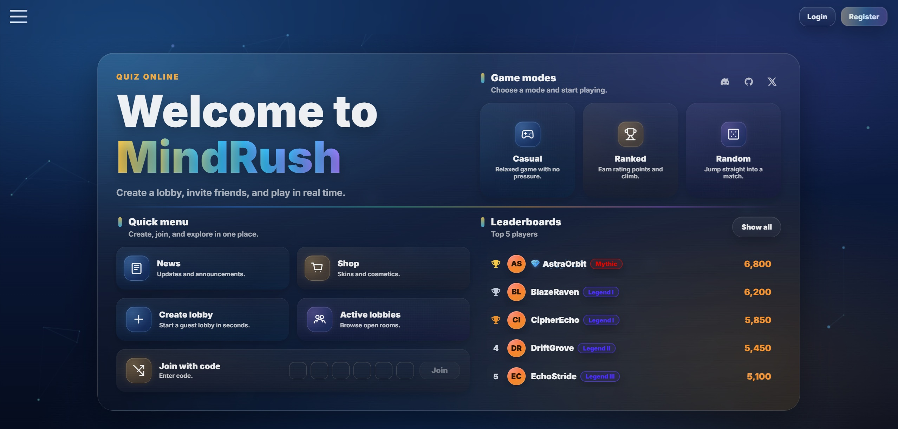
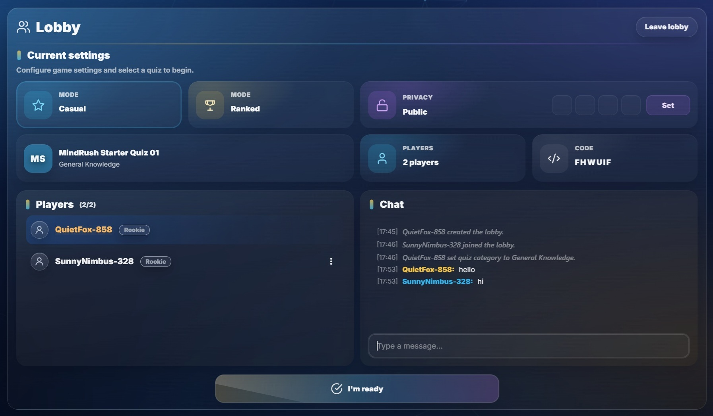
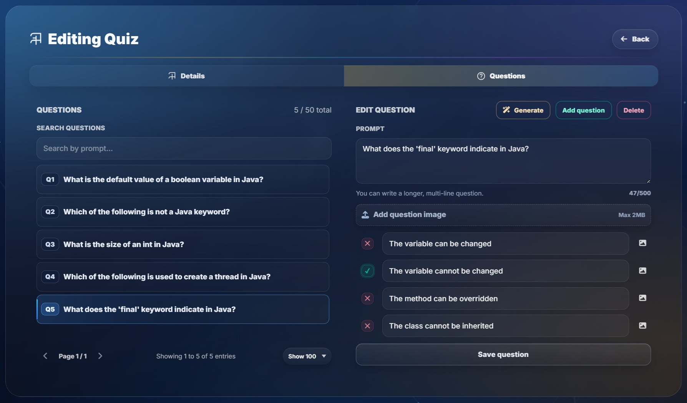
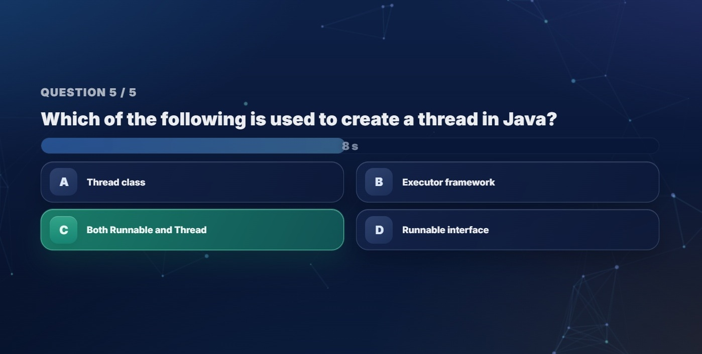
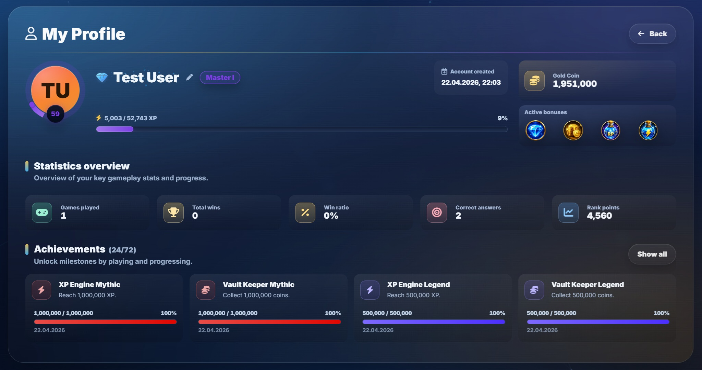
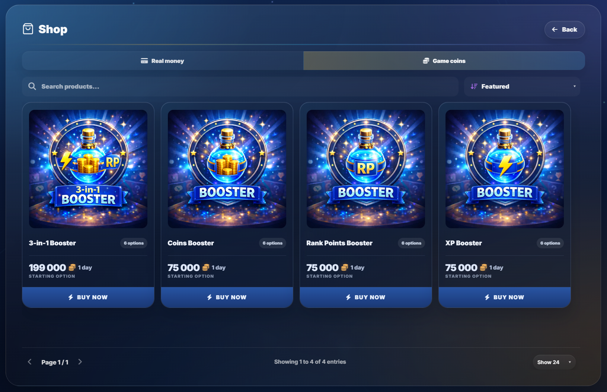
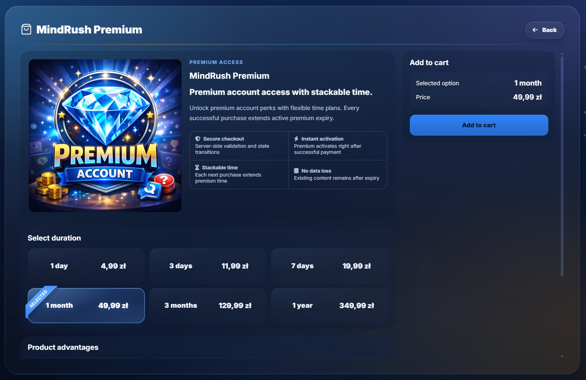

# MindRush - Quiz Online

MindRush is a full-stack multiplayer quiz platform built with Spring Boot and Angular.

It combines real-time lobby gameplay, guest and authenticated user flows, quiz management, and production-style deployment in a portfolio-ready product.

## TL;DR
- Real-time multiplayer quiz platform with live lobbies and gameplay
- Guest sessions and authenticated accounts secured with HttpOnly cookie-based auth
- Quiz creation, moderation, progression, leaderboards, notifications, and achievements
- In-app shop with admin-managed catalog, cart flow, premium subscriptions, and coins-based boosters
- CI/CD delivery with Docker, GHCR, GitHub Actions, and VPS deployment

## Highlights
- Real-time lobby flow with WebSocket updates, chat, ready state, and game lifecycle handling
- Guest-first onboarding that lets users enter the product before registration
- Custom quiz workflow with editing, moderation, and media upload support
- Profile progression with XP, rank points, achievements, and persistent player stats
- Shop domain with dual pricing modes (real money + game coins), cart aggregation, order lifecycle, and fulfillment handlers
- Separate public demo environment with synthetic data, scheduled resets, and reduced integrations
- Production-style deployment based on immutable Docker images published from CI

## Core Features
- Real-time multiplayer quiz flow with lobbies, ranked and casual modes, and live state updates
- Guest sessions for anonymous play and authenticated accounts secured with JWT-based HttpOnly cookies
- Quiz library, moderation, achievements, notifications, and leaderboard features
- Shop catalog, single-product checkout, cart checkout, premium extension logic, and coin-based purchases
- Dockerized delivery pipeline with GitHub Actions, GHCR, and VPS deployment

## Application Preview
Main dashboard view presenting the landing experience, game modes, quick actions, and leaderboard panel.

<p align="center">
  
</p>

### Selected Views
<table>
  <tr>
    <td width="50%" valign="top">
      
      <br />
      <strong>Lobby setup and live chat</strong><br />
      Configure the room, review players, and coordinate the match before the game starts.
    </td>
    <td width="50%" valign="top">
      
      <br />
      <strong>Quiz editor and question management</strong><br />
      Create and update question sets, manage answers, and work with the custom quiz flow.
    </td>
  </tr>
  <tr>
    <td width="50%" valign="top">
      
      <br />
      <strong>Real-time gameplay</strong><br />
      Timed questions with instant answer selection designed for a clear multiplayer experience.
    </td>
    <td width="50%" valign="top">
      
      <br />
      <strong>Profile and progression</strong><br />
      Track XP, rank points, player statistics, and achievement progress in the account dashboard.
    </td>
  </tr>
  <tr>
    <td width="50%" valign="top">
      
      <br />
      <strong>Shop catalog overview</strong><br />
      Browse products by pricing segment, search, sort, and move to detailed checkout views.
    </td>
    <td width="50%" valign="top">
      
      <br />
      <strong>Single product checkout</strong><br />
      Review trust highlights and plan options, then buy instantly with coins or add fiat plans to cart.
    </td>
  </tr>
</table>

## Live Demo
`https://demo-mindrush.rafalkislowski.pl`

Public demo uses synthetic data and resets daily.
Recommended flow: enter as guest and browse leaderboards, active lobbies, quiz library, and live game flow.

## Tech Stack
**Frontend**
- Angular 18
- TypeScript
- SCSS
- STOMP / WebSocket client

**Backend**
- Java 17
- Spring Boot 3
- Spring Web
- Spring Security with JWT in HttpOnly cookies
- Spring Data JPA
- MySQL
- Flyway

**Infrastructure**
- Docker Compose
- GitHub Container Registry (GHCR)
- GitHub Actions

## Architecture
- Angular frontend communicates with the Spring Boot backend through REST endpoints and live WebSocket channels
- Authentication, quiz management, lobby actions, and admin workflows are handled on the backend
- MySQL stores application data, while Flyway manages versioned schema evolution
- CI builds immutable Docker images, publishes them to GHCR, and deploys them to a VPS stack

### High-Level Flow
`Angular frontend`
-> `REST / WebSocket`
-> `Spring Boot API`
-> `MySQL`

Deployment path:
`GitHub Actions`
-> `GHCR`
-> `VPS + Docker Compose`

## Key Engineering Decisions
### JWT in HttpOnly cookies
Authentication uses short-lived access tokens and refresh tokens stored in HttpOnly cookies instead of browser storage.

### Guest sessions as first-class users
The platform supports anonymous gameplay through server-managed guest sessions, allowing users to enter the product before registration.

### Presence handling beyond unload events
Because browser disconnect events are unreliable, the app uses heartbeat-based presence tracking and backend cleanup for stale sessions.

### Separate demo environment
The public demo runs on a dedicated `demo` profile with synthetic data, reduced integrations, and scheduled resets.

### Immutable CI/CD pipeline
Production deployment is based on Docker images built in CI, published to GHCR, and pulled on the VPS instead of building directly on the server.

## Deployment Architecture
- `CI` runs on every `push` and `pull_request`
- `CD` runs after successful `CI` on branch `main`
- backend and frontend are built as immutable Docker images and published to `ghcr.io`
- the VPS pulls the exact image tags produced by the successful pipeline and recreates containers with `docker compose up -d`
- public traffic is served through an existing reverse-proxy Docker network, while MindRush runs as a separate Docker stack behind it
- MySQL data and uploaded media remain persistent in Docker volumes

This separates responsibilities cleanly:
- GitHub Actions verifies and packages the release
- GHCR stores versioned deployment artifacts
- the VPS only runs prebuilt images and applies the rollout

## Production pre-flight
Before deploying on VPS, prepare environment variables and production profile:

1. Copy `.env.example` to your local secret file (`.env`, system env, or host panel vars) and set real values.
2. Use `SPRING_PROFILES_ACTIVE=prod` on server.
3. Ensure `JWT_SECRET`, `APP_CORS_ALLOWED_ORIGINS`, `APP_FRONTEND_BASE_URL` are set.
4. For existing databases created before Flyway:
   - keep `APP_FLYWAY_BASELINE_ON_MIGRATE=true` (default),
   - first start will create Flyway history baseline.
5. Rotate any previously used API/SMTP credentials before public demo deployment.

## Demo profile
For a portfolio/public demo, run a separate deployment with `SPRING_PROFILES_ACTIVE=demo` and a separate database.

What the `demo` profile does:
- disables mail, OpenAI, and bootstrap admin
- seeds starter quizzes plus a curated demo leaderboard
- creates a few believable demo lobbies and keeps light simulated activity running
- exposes a visible frontend banner and `/api/app/info`
- resets demo data on startup and on a daily cron (`app.demo.reset.*`)

Recommended approach:
- never point `demo` at your production database
- keep `demo` on a separate subdomain / compose stack
- tell visitors that demo data is synthetic and resets daily

## CI/CD for VPS
This repository includes a production-style CI/CD path based on GitHub Actions + GHCR + Docker Compose on VPS:

- `CI` workflow runs on every `push` and `pull_request`
- `CD` workflow runs after successful `CI` on branch `main`
- backend and frontend are built into versioned Docker images and pushed to `ghcr.io`
- VPS pulls fresh images and updates containers automatically with `docker compose up -d`

Why this is better than `git pull && docker compose build` on the server:
- production uses immutable images built in CI, not ad-hoc builds on VPS
- deploy is faster and more repeatable
- you keep a clean separation between verification (`CI`) and release (`CD`)
- rollback is easier because deployments are tied to image tags and commit SHAs

### 1) Prepare the VPS once
Requirements on the server:
- Docker Engine
- Docker Compose v2 plugin (`docker compose`)
- an `.env` file placed in your deployment directory, for example `/opt/mindrush/.env`

Bootstrap example on VPS:

```bash
sudo mkdir -p /opt/mindrush
sudo chown -R $USER:$USER /opt/mindrush
cd /opt/mindrush
curl -o .env.example https://raw.githubusercontent.com/rafal-kislowski/mindrush-online-quiz/main/.env.example
cp .env.example .env
```

Then edit `.env` and set production values, especially:
- `JWT_SECRET`
- `APP_CORS_ALLOWED_ORIGINS`
- `APP_FRONTEND_BASE_URL`
- `MYSQL_PASSWORD`
- `MYSQL_ROOT_PASSWORD`
- `AUTH_COOKIE_SECURE=true`

### 2) Add GitHub repository secrets
In GitHub repository settings -> `Secrets and variables` -> `Actions`, add:

- `VPS_HOST` -> VPS IP or domain
- `VPS_PORT` -> usually `22`
- `VPS_USER` -> deployment user on VPS
- `VPS_SSH_KEY` -> private SSH key for that user
- `VPS_APP_DIR` -> deployment directory, for example `/opt/mindrush`
- `VPS_DEMO_APP_DIR` -> optional second deployment directory for public demo, for example `/opt/mindrush-demo`

### 3) What happens on deploy
After every push to `main`:

1. GitHub Actions runs tests and builds the app.
2. CI builds Docker images for backend and frontend and pushes them to GHCR.
3. Workflow copies `docker-compose.vps.yml` and the deploy script to the VPS.
4. VPS logs into GHCR, pulls new images and recreates containers.

Files used by the deployment:
- `docker-compose.vps.yml`
- `deploy/vps/remote-deploy.sh`
- `.github/workflows/ci.yml`
- `.github/workflows/cd.yml`

### 4) First deployment notes
- The production workflow deploys only from `main`.
- MySQL is intentionally not published to the public internet in `docker-compose.vps.yml`.
- Uploaded files remain persistent in Docker volume `backend_uploads`.
- Database data remains persistent in Docker volume `mindrush_mysql_data`.
- The frontend can join an existing reverse-proxy Docker network through `PROXY_NETWORK`.
- If you use a custom domain, terminate HTTPS in front of the app (for example Nginx Proxy Manager, Traefik or Nginx on the VPS) and keep `AUTH_COOKIE_SECURE=true`.

### Parallel prod + demo on one VPS
The repository can now run two independent stacks from the same `docker-compose.vps.yml` as long as:
- production and demo use different VPS directories
- each directory has its own `.env`
- production and demo use different databases
- demo uses the `demo` Spring profile and its own subdomain

Suggested layout:
- prod app dir: `/home/portfolio/mindrush-online-quiz`
- demo app dir: `/home/portfolio/mindrush-online-quiz-demo`
- prod env: create `/home/portfolio/mindrush-online-quiz/.env`
- demo env: create `/home/portfolio/mindrush-online-quiz-demo/.env` from `.env.demo.example`

Suggested demo env values:
- `SPRING_PROFILES_ACTIVE=demo`
- `MYSQL_DATABASE=mindrush_demo`
- `APP_CORS_ALLOWED_ORIGINS=https://demo-mindrush.rafalkislowski.pl`
- `APP_FRONTEND_BASE_URL=https://demo-mindrush.rafalkislowski.pl`
- `FRONTEND_PORT=8084`
- `PROXY_FRONTEND_HOSTNAME=demo-mindrush-frontend`
- `APP_MAIL_ENABLED=false`
- `OPENAI_ENABLED=false`
- `ADMIN_EMAIL=`
- `ADMIN_PASSWORD=`

Use a different `PROXY_FRONTEND_HOSTNAME` for each stack so the reverse proxy can route prod and demo to separate frontend containers on the shared Docker network.

## Dockerized stack (frontend + backend + db)
The repository now supports running the whole app in containers:

```bash
docker compose up -d --build
```

Default endpoints:
- App (frontend + API proxy): `http://localhost`
- MySQL: `localhost:3306`

Optional phpMyAdmin (tools profile):
```bash
docker compose --profile tools up -d
```
- phpMyAdmin: `http://localhost:8081`

Notes:
- Frontend container serves Angular via Nginx and proxies `/api`, `/ws`, `/media` to backend.
- Uploaded media is persisted in Docker volume `backend_uploads`.
- For local HTTP testing (no TLS), set `AUTH_COOKIE_SECURE=false`. For VPS with HTTPS keep `true`.

## Local setup

### 1) Database (MySQL)
From the repository root:

```bash
docker compose up -d mysql
```

Defaults from `docker-compose.yml`:
- DB: `mindrush`
- User/Pass: `mindrush` / `mindrush`
- Root password: `root`
- Port: `3306`

Optional (if enabled in `docker-compose.yml`):
- phpMyAdmin: `http://localhost:8081` (server: `mysql`)

### 2) Configuration (the `local` profile)
The repo keeps a base config without secrets: `backend/src/main/resources/application.properties`.

Local config lives in a separate file that is ignored by Git: `backend/src/main/resources/application-local.properties`.
Create it locally (or adjust) e.g.:

```properties
spring.datasource.url=jdbc:mysql://localhost:3306/mindrush?serverTimezone=UTC
spring.datasource.username=mindrush
spring.datasource.password=mindrush
```

Optional (admin AI question generation, disabled by default):

```properties
OPENAI_ENABLED=true
OPENAI_API_KEY=your-openai-api-key
OPENAI_MODEL=gpt-4o-mini
OPENAI_MAX_QUESTIONS_PER_REQUEST=100
```

### 3) Run the backend
Windows:

```powershell
cd backend
.\mvnw.cmd spring-boot:run -Dspring-boot.run.profiles=local
```

Linux/macOS:

```bash
cd backend
./mvnw spring-boot:run -Dspring-boot.run.profiles=local
```

Alternatively set `SPRING_PROFILES_ACTIVE=local`.

The app starts on `http://localhost:8080`.

## Test endpoint
- `GET /api/health` -> `{"status":"UP"}` (no auth required)

## Frontend (Angular)
The repository contains an Angular app in `frontend/` (dev proxy to backend for cookies + WebSocket).

```powershell
cd frontend
npm install
npm start
```

## Guest session (anonymous)
Creates/refreshes an anonymous guest session backed by DB + an HttpOnly cookie:
- `POST /api/guest/session` -> sets `guestSessionId` cookie
- `DELETE /api/guest/session` -> clears cookie (and revokes the session server-side)
- `GET /api/guest/session` -> returns current session info (including generated `displayName`)
- `POST /api/guest/session/heartbeat` -> keeps the session “alive” (updates `lastSeenAt`, extends expiry), returns `204 No Content`

Notes:
- Guest `displayName` is generated server-side (safe characters, no user input).

### Presence (disconnect handling)
Browsers don’t always fire `beforeunload` / `sendBeacon` reliably (crash, sleep, network loss, background-tab throttling), so the app uses heartbeat tracking, WebSocket disconnect grace, and backend cleanup:
- Frontend sends `POST /api/guest/session/heartbeat` periodically.
- WebSocket disconnects are buffered with a short reconnect grace period before removal.
- Backend removes stale guests from **OPEN** lobbies only (never during `IN_GAME`).

Config (current defaults):
```properties
# Background-tab tolerant inactivity timeout
lobby.presence.timeout=PT15M

# Short grace window after WebSocket disconnect
lobby.presence.reconnect-grace=PT45S
lobby.presence.reconnect-grace.cleanup.fixedDelayMs=2000

# Empty lobby retention before cleanup
lobby.empty.ttl=PT10M
```

## Auth (email/password)
Authentication uses a short-lived access JWT + a long-lived refresh token, both stored in **HttpOnly cookies**:
- `accessToken` (JWT)
- `refreshToken` (random token, server-side persisted and rotatable)

Endpoints:
- `POST /api/auth/register` -> creates a user (email + nickname) and sends verification email
- `POST /api/auth/login` -> logs in (sets cookies)
- `POST /api/auth/refresh` -> rotates refresh token + issues a new access token (sets cookies)
- `POST /api/auth/logout` -> revokes refresh token and clears cookies
- `GET /api/auth/me` -> current authenticated user
- `POST /api/auth/verification/resend` -> sends verification email again (generic response, no account enumeration)
- `POST /api/auth/verify-email` -> verifies account email using one-time token
- `POST /api/auth/password/forgot` -> sends password reset email (generic response, no account enumeration)
- `POST /api/auth/password/reset` -> sets a new password using one-time reset token

Notes:
- The UI shows `displayName` (nickname) in game/lobby instead of email.
- Verification and reset emails are rendered with Thymeleaf HTML templates (`backend/src/main/resources/templates/mail/*`).
- Password reset and email verification tokens are hashed server-side and stored in `auth_action_tokens`.
- Login/refresh for unverified accounts is blocked by default (`app.auth.require-verified-email=true`).

Mail configuration (example):
```properties
app.mail.enabled=true
app.mail.from=no-reply@mindrush.example
app.mail.support-email=support@mindrush.example
app.mail.frontend-base-url=https://app.mindrush.example
app.mail.verify-path=/verify-email
app.mail.reset-path=/reset-password
app.mail.verify-ttl=PT24H
app.mail.reset-ttl=PT30M
app.mail.verify-resend-cooldown=PT2M
app.mail.reset-request-cooldown=PT2M
spring.mail.host=smtp.example.com
spring.mail.port=587
spring.mail.username=...
spring.mail.password=...
spring.mail.properties.mail.smtp.auth=true
spring.mail.properties.mail.smtp.starttls.enable=true
```

Local Gmail quick start (development):
- Create a Google App Password (recommended for SMTP) and use that password, not your normal account password.
- Set variables before starting backend (PowerShell example):

```powershell
$env:APP_MAIL_ENABLED="true"
$env:APP_MAIL_FROM="your-address@gmail.com"
$env:APP_MAIL_SUPPORT="your-address@gmail.com"
$env:APP_FRONTEND_BASE_URL="http://localhost:4200"
$env:APP_MAIL_VERIFY_RESEND_COOLDOWN="PT2M"
$env:APP_MAIL_RESET_REQUEST_COOLDOWN="PT2M"
$env:SMTP_HOST="smtp.gmail.com"
$env:SMTP_PORT="587"
$env:SMTP_USERNAME="your-address@gmail.com"
$env:SMTP_PASSWORD="your-16-char-app-password"
$env:SMTP_AUTH="true"
$env:SMTP_STARTTLS="true"
```

- If you need temporary local behavior without mandatory activation, set `APP_AUTH_REQUIRE_VERIFIED_EMAIL=false`.

## API error format
Validation and business errors return a consistent JSON body:

```json
{
  "timestamp": "2026-02-19T15:00:00Z",
  "status": 400,
  "error": "Bad Request",
  "code": "VALIDATION_ERROR",
  "message": "Validation failed",
  "path": "/api/lobbies",
  "validationErrors": [
    { "field": "password", "message": "PIN must be exactly 4 digits", "rejectedValue": "12" }
  ]
}
```

## Progression (XP / RP / coins)
Both guests and authenticated users accumulate:
- `xp` (experience, used to calculate level; max level is 99 in UI)
- `rankPoints` (RP, used for ranks/leaderboards)
- `coins` (simple in-game currency)

These values are returned by:
- `GET /api/auth/me` (authenticated user)
- `GET /api/guest/session` (guest session)

### Bootstrap admin (local only)
To create an admin account automatically on startup, set:
```properties
app.bootstrap.admin.email=admin@example.com
app.bootstrap.admin.password=Password123
```
Recommended for dev:
```properties
app.jwt.secret=change-me-long-random
```

## Lobby
Lobbies are identified by a 6-character code and work for both guests and logged-in users.

- `POST /api/lobbies` -> creates a lobby (requires a valid `guestSessionId` cookie)
  - optional JSON body:
    - `{ "password": "1234" }` (4-digit PIN, private lobby)
    - `{ "maxPlayers": 2..5 }` (for guests effectively max 2, for authenticated users 2-5)
- `GET /api/lobbies/{code}` -> fetches lobby state
- `POST /api/lobbies/{code}/join` -> joins a lobby (requires a valid `guestSessionId` cookie)
  - optional JSON body (when PIN is set): `{ "password": "1234" }`
- `POST /api/lobbies/{code}/password` -> changes lobby privacy (owner only, lobby must be `OPEN`)
  - `{ "password": "1234" }` -> set/update PIN (private lobby)
  - `{}` -> clear PIN (public lobby)
- `POST /api/lobbies/{code}/max-players` -> updates max players (owner only)
- `POST /api/lobbies/{code}/selected-quiz` -> updates selected quiz (owner only)
- `POST /api/lobbies/{code}/leave` -> leaves a lobby (requires a valid `guestSessionId` cookie)
- `POST /api/lobbies/{code}/close` -> closes a lobby for new joins (owner only)

Max players:
- Guests: up to `2`
- Authenticated users: `2..5`

Notes:
- In Postman, call `POST /api/guest/session` first (cookie jar must be enabled) and keep the returned `guestSessionId` cookie for lobby requests.
- `close` prevents new players from joining (status becomes `CLOSED`).
- If the owner leaves and another player remains, ownership is transferred to the remaining player.
- If the last player leaves, lobby is marked empty and removed by cleanup scheduler after TTL (`lobby.empty.ttl`, default `PT10M`).
- Leaving the lobby is blocked while a game is in progress (`IN_GAME`).

## Quizzes (read-only)
Public, read-only quiz endpoints (no auth required):
- `GET /api/quizzes` -> list quizzes
- `GET /api/quizzes/{id}` -> quiz details
- `GET /api/quizzes/{id}/questions` -> quiz questions + answer options (does not expose correct answers)

Notes:
- Only quizzes with status `ACTIVE` are exposed publicly. Non-active quizzes return `404`.
- Each quiz item includes `source`:
  - `official` -> system/admin quiz (stored in DB as `quiz_source=OFFICIAL`)
  - `custom` -> user-created and shared quiz (stored in DB as `quiz_source=CUSTOM`)
  - `library` is a frontend view/filter concept (user's own quizzes), not a separate DB enum value.

## Library (user-created quizzes)
Endpoints for authenticated users:
- `GET /api/library/quizzes/mine` -> list your quizzes
- `GET /api/library/quizzes/mine/{id}` -> details with questions + correct answers (owner only)
- `GET /api/library/quizzes/policy` -> current limits + usage counters for your account tier
- `GET /api/library/quizzes/public` -> list public library quizzes (official + approved custom)
- `GET /api/library/quizzes/favorites` -> list your favorited public quizzes
- `POST /api/library/quizzes` -> create quiz draft
- `PUT /api/library/quizzes/{id}` -> update draft/owned quiz
- `POST /api/library/quizzes/{id}/questions` -> add question (4 options, exactly 1 correct)
- `PUT /api/library/quizzes/{id}/questions/{questionId}` -> update question/options
- `DELETE /api/library/quizzes/{id}/questions/{questionId}` -> delete question
- `POST /api/library/quizzes/{id}/submit` -> send quiz to moderation
- `POST /api/library/quizzes/{id}/favorite-toggle` -> add/remove quiz from favorites
- `PUT /api/library/quizzes/{id}/status` -> move draft/trash state (`ACTIVE` cannot be set directly by user)
- `DELETE /api/library/quizzes/{id}` -> move to trash
- `DELETE /api/library/quizzes/{id}/purge` -> permanently delete (only from trash)
- `POST /api/library/media` (`multipart/form-data`, field: `file`) -> upload image, returns `{ "url": "/media/..." }`

Notes:
- Limits are enforced on backend and configurable in `application.properties` under `app.library.policy.*` (`user` and `premium` tiers).
- Default `USER` limits: `20` owned quizzes, `5` published quizzes, `3` pending submissions, `50` max questions/quiz, `10` question images/quiz.
- Submission requires at least `5` questions by default.
- User media URLs in library flows must reference stored files (`/media/...`) and avatar colors must be valid HEX values.
- User-created quiz answer options are text-only (option images are currently disabled for library/user flows).
- Question image limit per tier is configurable via `app.library.policy.<tier>.max-question-images-per-quiz`.
- Upload limits and MIME whitelist are controlled by `app.library.policy.media.*` (default max upload `2MB`).
- Favorite operations are available only for publicly visible quizzes.

## Shop (catalog, cart, checkout)
The shop module supports both real-money-style checkout simulation and in-game coin purchases with backend-validated fulfillment.

### Shop API (public + authenticated)
- `GET /api/shop/catalog` -> public product catalog
- `GET /api/shop/products/{slug}` -> public single product details (trust highlights, advantages, plans)
- `GET /api/shop/orders` -> authenticated order history
- `POST /api/shop/orders` -> create one order line (`productSlug`, `planCode`, `quantity`)
- `POST /api/shop/orders/batch` -> create multiple order lines in one request (cart checkout)
- `POST /api/shop/orders/{publicId}/simulate-payment` -> simulate `SUCCESS`, `FAILURE`, or `CANCEL`

### Shop behavior and safeguards
- Catalog supports dual pricing segmentation in UI: `Real money` and `Game coins`.
- Coin-priced products can be purchased directly from a single product view (`Buy now`), including client confirmation.
- Fiat-style plans are handled through cart flow with quantity controls and batch checkout simulation.
- Cart state is persisted in local storage and normalized by `productSlug + planCode` (quantity aggregation for duplicate lines).
- Quantity validation is enforced on backend (`1..1000`), including overflow-safe multiplication for totals/effects.
- For coin purchases, balance is validated server-side before payment success is accepted.
- Fulfillment is idempotent: already fulfilled paid orders are not re-applied.

### Fulfillment model
- `DURATION_DAYS` effects:
  - `PREMIUM_ACCESS` -> activates or extends premium
  - `XP_BOOST`, `RP_BOOST`, `COINS_BOOST` -> extends reward boost expiration windows
- `RESOURCE_GRANT` effects:
  - currently `COINS`, `XP`, `RANK_POINTS`
- Order status lifecycle: `PENDING -> PAID|FAILED|CANCELLED`

### Shop communications
- Cart checkout sends one consolidated order email (grouped line items with quantities/totals).
- Premium flow sends dedicated activation/extension email copy (including extension duration when premium was already active).
- Premium activation/extension also creates in-app notification entries.

### Admin shop management API
- `GET /api/admin/shop/products` -> list products
- `GET /api/admin/shop/products/config` -> pricing modes, currencies, and supported effect catalog
- `GET /api/admin/shop/products/{id}` -> product detail for admin editor
- `POST /api/admin/shop/products` -> create product
- `PUT /api/admin/shop/products/{id}` -> update product
- `PUT /api/admin/shop/products/{id}/status` -> change product status

### Shop configuration
Key backend properties (see `backend/src/main/resources/application.properties`):
- `app.shop.payment-provider` (default `SIMULATED`)
- `app.shop.premium-expiration-check-ms`
- `app.shop.pricing-currencies[*]`
- optional PayU sandbox placeholders (`app.shop.payu.*`) for next integration step

## Admin (quiz management)
Admin-only quiz endpoints (requires `ADMIN` role):
- `GET /api/admin/quizzes` -> list quizzes
- `GET /api/admin/quizzes/{id}` -> quiz detail including questions and correct answers
- `POST /api/admin/quizzes` -> create quiz
- `PUT /api/admin/quizzes/{id}` -> update quiz (title/description/category/avatar/game rules)
- `PUT /api/admin/quizzes/{id}/status` -> set quiz status (`DRAFT`, `ACTIVE`, `TRASHED`)
- `DELETE /api/admin/quizzes/{id}` -> move quiz to trash (`TRASHED`)
- `DELETE /api/admin/quizzes/{id}/purge` -> permanently delete quiz (questions/options + stored media)
- `POST /api/admin/quizzes/{id}/questions` -> add a question (4 options, exactly 1 correct)
- `PUT /api/admin/quizzes/{id}/questions/{questionId}` -> update question + options (requires option ids, exactly 1 correct)
- `DELETE /api/admin/quizzes/{id}/questions/{questionId}` -> delete question

### Admin moderation queue
Admin-only submission moderation endpoints:
- `GET /api/admin/quiz-submissions` -> list pending user submissions
- `GET /api/admin/quiz-submissions/{id}` -> submission detail (with moderation context)
- `POST /api/admin/quiz-submissions/{id}/approve` -> approve submission (`expectedSubmissionVersion` required)
- `POST /api/admin/quiz-submissions/{id}/undo-approve` -> move approved submission back to pending review (`expectedSubmissionVersion` required)
- `POST /api/admin/quiz-submissions/{id}/reject` -> reject submission with reason and optional per-question issues
- `POST /api/admin/quiz-submissions/{id}/owner/ban` -> ban submission owner
- `POST /api/admin/quiz-submissions/{id}/owner/unban` -> remove owner ban
- `DELETE /api/admin/quiz-submissions/{id}/avatar` -> remove submission avatar image
- `DELETE /api/admin/quiz-submissions/{id}/questions/{questionId}/image` -> remove question image
- `DELETE /api/admin/quiz-submissions/{id}/questions/{questionId}/options/{optionId}/image` -> remove answer option image

Notes:
- Approve/reject sends both an in-app notification and an email with deep-link to moderation context in library view.
- If quiz becomes unavailable before user opens the link, frontend falls back to dashboard with warning toast.

## User notifications
Persistent user notifications are stored in DB table `user_notifications` and exposed via REST + SSE.

Current categories:
- `moderation` (already used for quiz approval/rejection)
- `reward` (gift-like notifications, reserved for future)
- `news` (platform updates, reserved for future)
- `system` (generic fallback)

Endpoints for authenticated users:
- `GET /api/notifications?limit=50` -> list notifications + unread count
- `POST /api/notifications/{id}/read` -> mark one notification as read
- `POST /api/notifications/{id}/dismiss` -> dismiss notification (removed from list)
- `POST /api/notifications/read-all` -> mark all visible notifications as read
- `GET /api/notifications/stream` -> server-sent events (`connected`, `refresh`) for live navbar updates

Notes:
- Moderation decisions generate notifications automatically when admin approves/rejects a submission.
- Frontend uses SSE to refresh navbar badge/list without page reload.
- Clicking a notification marks it as read and can navigate to target route (for moderation: library with relevant query params).
- Deleting notification is an explicit action (with confirmation in UI) and maps to `dismiss` API.

## Achievements
Authenticated player achievements are calculated from finished games and creator activity.

Endpoints:
- `GET /api/achievements/me` -> achievement catalog with unlock/progress state for current user

Response highlights:
- `title`, `description`
- `totalCount`, `unlockedCount`, `completionPct`
- `items[]` with `key`, `title`, `description`, `icon`, `category`, `tier`, `tierColor`, `target`, `progress`, `unlocked`, `unlockedAt`

Notes:
- Unlocks are persisted in `user_achievement_unlocks`.
- Achievement unlock emits a `reward` notification for the player.

Optional dev seed data:
- Seed is enabled by default for local development (`app.seed.enabled=true`) and runs only when there are no quizzes in DB.
- To disable: set `app.seed.enabled=false`.
- Current seed creates `12` starter quizzes with `5` questions each (good for UI/pagination testing).

## Game (lobby)
Real-time game flow on top of lobbies with REST commands and WebSocket notifications.

Endpoints (requires a valid `guestSessionId` cookie and being in the lobby):
- `POST /api/lobbies/{code}/game/start` -> starts a game (owner only), body: `{ "quizId": 1, "mode": "STANDARD|THREE_LIVES|TRAINING" }`
- `GET /api/lobbies/{code}/game/state` -> current state (question/reveal/finished)
- `POST /api/lobbies/{code}/game/answer` -> submit answer, body: `{ "questionId": 123, "optionId": 456 }`
- `POST /api/lobbies/{code}/game/end` -> end game (owner only)

Notes:
- `mode` is optional on start; default is `STANDARD`.
- `THREE_LIVES` and `TRAINING` are allowed only in solo lobbies (1 player).
- Both players get the same question; answer options are shuffled per player.
- The response includes per-player correctness only in `REVEAL` stage (after everyone answers).
- Scoring uses a base score + a speed bonus for correct answers (faster answers give more points). Ties are broken by total points, then correct answers, then total correct answer time.
- Games are time-boxed:
  - `QUESTION` duration is taken from the quiz settings (`questionTimeLimitSeconds`), default `15s`.
  - `REVEAL` defaults to `3s` (configurable via `game.guest.reveal-duration`).
  - The response exposes `stageEndsAt` and `stageTotalMs` for countdowns.
- In `TRAINING` mode, question stage has no timer (`stageEndsAt=null`, `stageTotalMs=null`).
- Starting a game is blocked if the quiz is not `ACTIVE`.
- If a player doesn't answer before `stageEndsAt`, the server records it as a wrong answer and the game continues normally.
- Auto-advance can be driven by polling `GET /state`, or by the built-in scheduler (`game.scheduler.enabled=true`).
- Lobby status becomes `IN_GAME` while a game is active, then returns to `OPEN` after the game ends.
- `GameStateDto` additionally exposes:
  - `mode` (`STANDARD`, `THREE_LIVES`, `TRAINING`)
  - `gameSessionId`
  - `finishReason` (`COMPLETED`, `MANUAL_END`, `EXPIRED`) when stage is finished
  - `livesRemaining` / `wrongAnswers` for `THREE_LIVES`

## Solo games
Standalone solo sessions (no lobby code needed):

- `POST /api/solo-games/start` -> starts solo game, body: `{ "quizId": 1, "mode": "STANDARD|THREE_LIVES|TRAINING" }`
- `GET /api/solo-games/{gameSessionId}/state` -> current solo state
- `POST /api/solo-games/{gameSessionId}/answer` -> submit answer, body: `{ "questionId": 123, "optionId": 456 }`
- `POST /api/solo-games/{gameSessionId}/end` -> manually finish solo game

Notes:
- User/guest can have only one active game at a time (lobby or solo).
- Starting solo game is blocked if user/guest is currently in a lobby.
- Solo sessions can expire after inactivity (finished with `finishReason=EXPIRED`).
- Always send `questionId` exactly as returned by `/state` (for some solo flows it can be a synthetic negative id).

## Active game lookup
Detect whether current guest has an active game:

- `GET /api/games/current`
  - `200 OK` with payload `{ "type":"SOLO|LOBBY", "gameSessionId":"...", "lobbyCode":"..." }`
  - `204 No Content` if there is no active game

## Casual best record (3 lives)
- `GET /api/casual/three-lives/best` -> best stored result for current guest/user session

Notes:
- Requires valid guest session cookie (call `POST /api/guest/session` first if needed).
- Returns either best record payload (`points`, `answered`, `durationMs`, `updatedAt`) or `null` when no record exists yet.

## WebSocket (STOMP)
The backend exposes STOMP WebSocket channels for lobby/game/chat updates.
Handshake requires a valid `guestSessionId` cookie.

- WebSocket endpoint: `ws://localhost:8080/ws`
- Topics:
  - `/topic/lobbies/{code}/lobby` -> broadcast lobby update event
  - `/topic/lobbies/{code}/game` -> broadcast game update event
  - `/topic/lobbies/{code}/chat` -> lobby chat messages
- User queue:
  - `/user/queue/lobbies/{code}/lobby` -> per-user lobby snapshot (includes viewer-specific fields like `isOwner`, `isParticipant`, owner PIN visibility)

Payload examples:
- Lobby broadcast event:
  - `{"type":"LOBBY_UPDATED","lobbyCode":"ABC123","serverTime":"...","state":null}`
- Lobby per-user snapshot:
  - `{"type":"LOBBY_SNAPSHOT","lobbyCode":"ABC123","serverTime":"...","state":{...}}`
- Game event:
  - `{"type":"GAME_UPDATED","lobbyCode":"ABC123","serverTime":"...","lobbyStatus":"IN_GAME","stage":"QUESTION"}`

If you run the frontend on a different origin, make sure cookies are sent and CORS/allowed origins are configured properly (currently `*` for dev).

## Tests

```powershell
cd backend
.\mvnw.cmd test

cd ..\frontend
npm test -- --watch=false --browsers=ChromeHeadless
```

## Roadmap
MindRush is actively evolving. Current next-step directions:
- connect the existing shop order lifecycle to a real sandbox payment gateway (PayU sandbox)
- expand shop offer with more cosmetic/profile personalization products
- continue gameplay and social feature iterations (modes, progression UX, retention loops)
- keep improving observability, operational hardening, and release automation

## License
MIT - see `LICENSE`.
